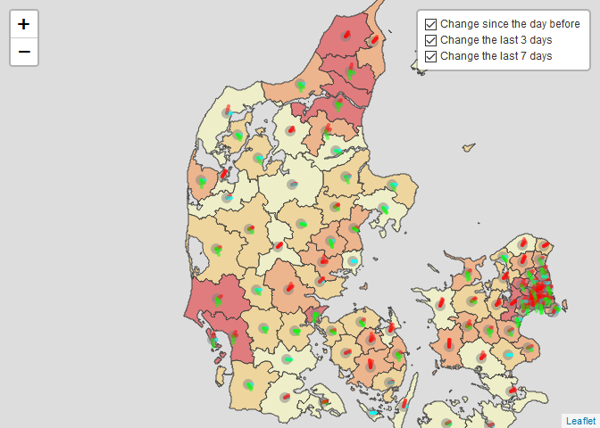
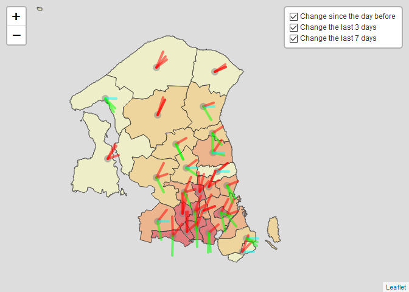

Covid
================

``` r
knitr::opts_chunk$set(echo = TRUE)
webshot::install_phantomjs()
```

    ## It seems that the version of `phantomjs` installed is greater than or equal to the requested version.To install the requested version or downgrade to another version, use `force = TRUE`.

``` r
library(here)
```

    ## here() starts at C:/Users/mathi/Documents/GitHub/dataVisSSI

``` r
library(tidyverse)
```

    ## -- Attaching packages --------------------------------------------------------------------------------------------------------- tidyverse 1.3.0 --

    ## v ggplot2 3.3.0     v purrr   0.3.4
    ## v tibble  3.0.1     v dplyr   1.0.2
    ## v tidyr   1.1.0     v stringr 1.4.0
    ## v readr   1.3.1     v forcats 0.5.0

    ## -- Conflicts ------------------------------------------------------------------------------------------------------------ tidyverse_conflicts() --
    ## x dplyr::filter() masks stats::filter()
    ## x dplyr::lag()    masks stats::lag()

``` r
library(roll)
library(magrittr)
```

    ## 
    ## Attaching package: 'magrittr'

    ## The following object is masked from 'package:purrr':
    ## 
    ##     set_names

    ## The following object is masked from 'package:tidyr':
    ## 
    ##     extract

``` r
deg2rad <- function(x) {
  radian <- x * pi / 180
  return(radian)
}

# import data frames COVID: cases, tests and population size of municipalities
dc <- read_delim(here("Municipality_cases_time_series.csv"), ";", escape_double = FALSE, trim_ws = TRUE)
```

    ## Parsed with column specification:
    ## cols(
    ##   .default = col_double(),
    ##   date_sample = col_date(format = "")
    ## )

    ## See spec(...) for full column specifications.

``` r
dt <- read_delim(here("Municipality_tested_persons_time_series.csv"), ";", escape_double = FALSE, trim_ws = TRUE)
```

    ## Parsed with column specification:
    ## cols(
    ##   .default = col_double(),
    ##   PrDate_adjusted = col_date(format = "")
    ## )
    ## See spec(...) for full column specifications.

``` r
dsize <- read_delim(here("Municipality_test_pos.csv"), ";", escape_double = FALSE, trim_ws = TRUE)
```

    ## Parsed with column specification:
    ## cols(
    ##   `Kommune_(id)` = col_double(),
    ##   `Kommune_(navn)` = col_character(),
    ##   Antal_testede = col_double(),
    ##   `Antal_bekræftede_COVID-19` = col_double(),
    ##   Befolkningstal = col_double(),
    ##   `Kumulativ_incidens_(per_100000)` = col_double()
    ## )

``` r
# make data tidy
dc %<>%
  pivot_longer(cols = !date_sample, names_to = "kommune", values_to = "casesDiagnosed") %>% arrange(kommune, date_sample)

dt %<>%
  pivot_longer(cols = !PrDate_adjusted, names_to = "kommune", values_to = "testsConducted") %>%
  arrange(kommune, PrDate_adjusted) %>%
  rename(date_sample = PrDate_adjusted)

# check there are no NA in the set
sum(is.na(dc$casesDiagnosed))
```

    ## [1] 0

``` r
sum(is.na(dt$testsConducted))
```

    ## [1] 0

``` r
sum(is.na(dt$testsConducted))
```

    ## [1] 0

``` r
sum(is.na(dsize$Befolkningstal))
```

    ## [1] 0

``` r
# make data compatible rename columns for merging and
dsize <- dsize %>%
  select(contains("Kom"), Befolkningstal) %>%
  rename("kID" = `Kommune_(id)`, "kommune" = `Kommune_(navn)`, population = Befolkningstal) %>%
  mutate(population = population * 1000) %>%
  select(-kID)

# check Kommune name can be used as key
dc[!(dc$kommune %in% dsize$kommune), ]$kommune
```

    ##   [1] "Copenhagen" "Copenhagen" "Copenhagen" "Copenhagen" "Copenhagen"
    ##   [6] "Copenhagen" "Copenhagen" "Copenhagen" "Copenhagen" "Copenhagen"
    ##  [11] "Copenhagen" "Copenhagen" "Copenhagen" "Copenhagen" "Copenhagen"
    ##  [16] "Copenhagen" "Copenhagen" "Copenhagen" "Copenhagen" "Copenhagen"
    ##  [21] "Copenhagen" "Copenhagen" "Copenhagen" "Copenhagen" "Copenhagen"
    ##  [26] "Copenhagen" "Copenhagen" "Copenhagen" "Copenhagen" "Copenhagen"
    ##  [31] "Copenhagen" "Copenhagen" "Copenhagen" "Copenhagen" "Copenhagen"
    ##  [36] "Copenhagen" "Copenhagen" "Copenhagen" "Copenhagen" "Copenhagen"
    ##  [41] "Copenhagen" "Copenhagen" "Copenhagen" "Copenhagen" "Copenhagen"
    ##  [46] "Copenhagen" "Copenhagen" "Copenhagen" "Copenhagen" "Copenhagen"
    ##  [51] "Copenhagen" "Copenhagen" "Copenhagen" "Copenhagen" "Copenhagen"
    ##  [56] "Copenhagen" "Copenhagen" "Copenhagen" "Copenhagen" "Copenhagen"
    ##  [61] "Copenhagen" "Copenhagen" "Copenhagen" "Copenhagen" "Copenhagen"
    ##  [66] "Copenhagen" "Copenhagen" "Copenhagen" "Copenhagen" "Copenhagen"
    ##  [71] "Copenhagen" "Copenhagen" "Copenhagen" "Copenhagen" "Copenhagen"
    ##  [76] "Copenhagen" "Copenhagen" "Copenhagen" "Copenhagen" "Copenhagen"
    ##  [81] "Copenhagen" "Copenhagen" "Copenhagen" "Copenhagen" "Copenhagen"
    ##  [86] "Copenhagen" "Copenhagen" "Copenhagen" "Copenhagen" "Copenhagen"
    ##  [91] "Copenhagen" "Copenhagen" "Copenhagen" "Copenhagen" "Copenhagen"
    ##  [96] "Copenhagen" "Copenhagen" "Copenhagen" "Copenhagen" "Copenhagen"
    ## [101] "Copenhagen" "Copenhagen" "Copenhagen" "Copenhagen" "Copenhagen"
    ## [106] "Copenhagen" "Copenhagen" "Copenhagen" "Copenhagen" "Copenhagen"
    ## [111] "Copenhagen" "Copenhagen" "Copenhagen" "Copenhagen" "Copenhagen"
    ## [116] "Copenhagen" "Copenhagen" "Copenhagen" "Copenhagen" "Copenhagen"
    ## [121] "Copenhagen" "Copenhagen" "Copenhagen" "Copenhagen" "Copenhagen"
    ## [126] "Copenhagen" "Copenhagen" "Copenhagen" "Copenhagen" "Copenhagen"
    ## [131] "Copenhagen" "Copenhagen" "Copenhagen" "Copenhagen" "Copenhagen"
    ## [136] "Copenhagen" "Copenhagen" "Copenhagen" "Copenhagen" "Copenhagen"
    ## [141] "Copenhagen" "Copenhagen" "Copenhagen" "Copenhagen" "Copenhagen"
    ## [146] "Copenhagen" "Copenhagen" "Copenhagen" "Copenhagen" "Copenhagen"
    ## [151] "Copenhagen" "Copenhagen" "Copenhagen" "Copenhagen" "Copenhagen"
    ## [156] "Copenhagen" "Copenhagen" "Copenhagen" "Copenhagen" "Copenhagen"
    ## [161] "Copenhagen" "Copenhagen" "Copenhagen" "Copenhagen" "Copenhagen"
    ## [166] "Copenhagen" "Copenhagen" "Copenhagen" "Copenhagen" "Copenhagen"
    ## [171] "Copenhagen" "Copenhagen" "Copenhagen" "Copenhagen" "Copenhagen"
    ## [176] "Copenhagen" "Copenhagen" "Copenhagen" "Copenhagen" "Copenhagen"
    ## [181] "Copenhagen" "Copenhagen" "Copenhagen" "Copenhagen" "Copenhagen"
    ## [186] "Copenhagen" "Copenhagen" "Copenhagen" "Copenhagen" "Copenhagen"
    ## [191] "Copenhagen" "Copenhagen" "Copenhagen" "Copenhagen" "Copenhagen"
    ## [196] "Copenhagen" "Copenhagen" "Copenhagen" "Copenhagen" "Copenhagen"
    ## [201] "Copenhagen" "Copenhagen" "Copenhagen" "Copenhagen"

``` r
dsize[!(dsize$kommune %in% dt$kommune), ]$kommune
```

    ## [1] "København"

``` r
dt[!(dt$kommune %in% dsize$kommune), ]$kommune
```

    ##   [1] "Copenhagen" "Copenhagen" "Copenhagen" "Copenhagen" "Copenhagen"
    ##   [6] "Copenhagen" "Copenhagen" "Copenhagen" "Copenhagen" "Copenhagen"
    ##  [11] "Copenhagen" "Copenhagen" "Copenhagen" "Copenhagen" "Copenhagen"
    ##  [16] "Copenhagen" "Copenhagen" "Copenhagen" "Copenhagen" "Copenhagen"
    ##  [21] "Copenhagen" "Copenhagen" "Copenhagen" "Copenhagen" "Copenhagen"
    ##  [26] "Copenhagen" "Copenhagen" "Copenhagen" "Copenhagen" "Copenhagen"
    ##  [31] "Copenhagen" "Copenhagen" "Copenhagen" "Copenhagen" "Copenhagen"
    ##  [36] "Copenhagen" "Copenhagen" "Copenhagen" "Copenhagen" "Copenhagen"
    ##  [41] "Copenhagen" "Copenhagen" "Copenhagen" "Copenhagen" "Copenhagen"
    ##  [46] "Copenhagen" "Copenhagen" "Copenhagen" "Copenhagen" "Copenhagen"
    ##  [51] "Copenhagen" "Copenhagen" "Copenhagen" "Copenhagen" "Copenhagen"
    ##  [56] "Copenhagen" "Copenhagen" "Copenhagen" "Copenhagen" "Copenhagen"
    ##  [61] "Copenhagen" "Copenhagen" "Copenhagen" "Copenhagen" "Copenhagen"
    ##  [66] "Copenhagen" "Copenhagen" "Copenhagen" "Copenhagen" "Copenhagen"
    ##  [71] "Copenhagen" "Copenhagen" "Copenhagen" "Copenhagen" "Copenhagen"
    ##  [76] "Copenhagen" "Copenhagen" "Copenhagen" "Copenhagen" "Copenhagen"
    ##  [81] "Copenhagen" "Copenhagen" "Copenhagen" "Copenhagen" "Copenhagen"
    ##  [86] "Copenhagen" "Copenhagen" "Copenhagen" "Copenhagen" "Copenhagen"
    ##  [91] "Copenhagen" "Copenhagen" "Copenhagen" "Copenhagen" "Copenhagen"
    ##  [96] "Copenhagen" "Copenhagen" "Copenhagen" "Copenhagen" "Copenhagen"
    ## [101] "Copenhagen" "Copenhagen" "Copenhagen" "Copenhagen" "Copenhagen"
    ## [106] "Copenhagen" "Copenhagen" "Copenhagen" "Copenhagen" "Copenhagen"
    ## [111] "Copenhagen" "Copenhagen" "Copenhagen" "Copenhagen" "Copenhagen"
    ## [116] "Copenhagen" "Copenhagen" "Copenhagen" "Copenhagen" "Copenhagen"
    ## [121] "Copenhagen" "Copenhagen" "Copenhagen" "Copenhagen" "Copenhagen"
    ## [126] "Copenhagen" "Copenhagen" "Copenhagen" "Copenhagen" "Copenhagen"
    ## [131] "Copenhagen" "Copenhagen" "Copenhagen" "Copenhagen" "Copenhagen"
    ## [136] "Copenhagen" "Copenhagen" "Copenhagen" "Copenhagen" "Copenhagen"
    ## [141] "Copenhagen" "Copenhagen" "Copenhagen" "Copenhagen" "Copenhagen"
    ## [146] "Copenhagen" "Copenhagen" "Copenhagen" "Copenhagen" "Copenhagen"
    ## [151] "Copenhagen" "Copenhagen" "Copenhagen" "Copenhagen" "Copenhagen"
    ## [156] "Copenhagen" "Copenhagen" "Copenhagen" "Copenhagen" "Copenhagen"
    ## [161] "Copenhagen" "Copenhagen" "Copenhagen" "Copenhagen" "Copenhagen"
    ## [166] "Copenhagen" "Copenhagen" "Copenhagen" "Copenhagen" "Copenhagen"
    ## [171] "Copenhagen" "Copenhagen" "Copenhagen" "Copenhagen" "Copenhagen"
    ## [176] "Copenhagen" "Copenhagen" "Copenhagen" "Copenhagen" "Copenhagen"
    ## [181] "Copenhagen" "Copenhagen" "Copenhagen" "Copenhagen" "Copenhagen"
    ## [186] "Copenhagen" "Copenhagen" "Copenhagen" "Copenhagen" "Copenhagen"
    ## [191] "Copenhagen" "Copenhagen" "Copenhagen" "Copenhagen" "Copenhagen"
    ## [196] "Copenhagen" "Copenhagen" "Copenhagen" "Copenhagen" "Copenhagen"
    ## [201] "Copenhagen" "Copenhagen" "Copenhagen" "Copenhagen" "Copenhagen"
    ## [206] "Copenhagen" "Copenhagen" "Copenhagen" "Copenhagen" "Copenhagen"
    ## [211] "Copenhagen" "Copenhagen" "Copenhagen" "Copenhagen" "Copenhagen"
    ## [216] "Copenhagen" "Copenhagen" "Copenhagen" "Copenhagen" "Copenhagen"
    ## [221] "Copenhagen" "Copenhagen" "Copenhagen" "Other"      "Other"     
    ## [226] "Other"      "Other"      "Other"      "Other"      "Other"     
    ## [231] "Other"      "Other"      "Other"      "Other"      "Other"     
    ## [236] "Other"      "Other"      "Other"      "Other"      "Other"     
    ## [241] "Other"      "Other"      "Other"      "Other"      "Other"     
    ## [246] "Other"      "Other"      "Other"      "Other"      "Other"     
    ## [251] "Other"      "Other"      "Other"      "Other"      "Other"     
    ## [256] "Other"      "Other"      "Other"      "Other"      "Other"     
    ## [261] "Other"      "Other"      "Other"      "Other"      "Other"     
    ## [266] "Other"      "Other"      "Other"      "Other"      "Other"     
    ## [271] "Other"      "Other"      "Other"      "Other"      "Other"     
    ## [276] "Other"      "Other"      "Other"      "Other"      "Other"     
    ## [281] "Other"      "Other"      "Other"      "Other"      "Other"     
    ## [286] "Other"      "Other"      "Other"      "Other"      "Other"     
    ## [291] "Other"      "Other"      "Other"      "Other"      "Other"     
    ## [296] "Other"      "Other"      "Other"      "Other"      "Other"     
    ## [301] "Other"      "Other"      "Other"      "Other"      "Other"     
    ## [306] "Other"      "Other"      "Other"      "Other"      "Other"     
    ## [311] "Other"      "Other"      "Other"      "Other"      "Other"     
    ## [316] "Other"      "Other"      "Other"      "Other"      "Other"     
    ## [321] "Other"      "Other"      "Other"      "Other"      "Other"     
    ## [326] "Other"      "Other"      "Other"      "Other"      "Other"     
    ## [331] "Other"      "Other"      "Other"      "Other"      "Other"     
    ## [336] "Other"      "Other"      "Other"      "Other"      "Other"     
    ## [341] "Other"      "Other"      "Other"      "Other"      "Other"     
    ## [346] "Other"      "Other"      "Other"      "Other"      "Other"     
    ## [351] "Other"      "Other"      "Other"      "Other"      "Other"     
    ## [356] "Other"      "Other"      "Other"      "Other"      "Other"     
    ## [361] "Other"      "Other"      "Other"      "Other"      "Other"     
    ## [366] "Other"      "Other"      "Other"      "Other"      "Other"     
    ## [371] "Other"      "Other"      "Other"      "Other"      "Other"     
    ## [376] "Other"      "Other"      "Other"      "Other"      "Other"     
    ## [381] "Other"      "Other"      "Other"      "Other"      "Other"     
    ## [386] "Other"      "Other"      "Other"      "Other"      "Other"     
    ## [391] "Other"      "Other"      "Other"      "Other"      "Other"     
    ## [396] "Other"      "Other"      "Other"      "Other"      "Other"     
    ## [401] "Other"      "Other"      "Other"      "Other"      "Other"     
    ## [406] "Other"      "Other"      "Other"      "Other"      "Other"     
    ## [411] "Other"      "Other"      "Other"      "Other"      "Other"     
    ## [416] "Other"      "Other"      "Other"      "Other"      "Other"     
    ## [421] "Other"      "Other"      "Other"      "Other"      "Other"     
    ## [426] "Other"      "Other"      "Other"      "Other"      "Other"     
    ## [431] "Other"      "Other"      "Other"      "Other"      "Other"     
    ## [436] "Other"      "Other"      "Other"      "Other"      "Other"     
    ## [441] "Other"      "Other"      "Other"      "Other"      "Other"     
    ## [446] "Other"

``` r
# ooops!
# for some reason one data frame uses Københaven the other Copenhagen),
dc$kommune <- str_replace(dc$kommune, "Copenhagen", "København")
dt$kommune <- str_replace(dt$kommune, "Copenhagen", "København")
# check again keys are clean OK re-run rows 35-37

# merge data together
dc <- merge(dc, dsize)
dt <- merge(dt, dsize)

# create new variables (e.g. rolling aggregates)
dc %<>%
  group_by(kommune) %>%
  mutate(
    casesDPer100k = casesDiagnosed / (population / 1000),
    dcr7d = roll_sum(casesDiagnosed, width = 7, min_obs = 1),
    dcr7dPer100k = dcr7d / (population / 1000),
    dcr7dPer100kCh1 = lag(dcr7dPer100k, 1) - dcr7dPer100k,
    dcr7dPer100kCh3 = lag(dcr7dPer100k, 3) - dcr7dPer100k,
    dcr7dPer100kCh7 = lag(dcr7dPer100k, 7) - dcr7dPer100k
  )

dt %<>%
  group_by(kommune) %>%
  mutate(
    testsPer100k = testsConducted / (population / 1000),
    tr7d = roll_sum(testsConducted, width = 7, min_obs = 1),
    tr7dP100k = tr7d / (population / 1000),
    tr7dP100kCh1 = lag(tr7dP100k, 1) - tr7dP100k,
    tr7dP100kCh3 = lag(tr7dP100k, 3) - tr7dP100k,
    tr7dP100kCh7 = lag(tr7dP100k, 7) - tr7dP100k
  )

# merge test with case data
# samsø doesn't exist in the dc dataset, which is why we cannot plot anything from it on the interactive map,
# as we are only plotting changes in the confirmed cases (dc), and not tests conducted (dt)
df <- merge(dc, dt)

df$PosTestRate7d <- df$dcr7dPer100k / df$tr7dP100k

# check there were no diagnosis without tests
sum(df$casesDiagnosed > df$testsConducted)
```

    ## [1] 0

## Covid data analysis DK overview

## Including Plots

``` r
library(leaflet)
library(dplyr)
library(sf)
```

    ## Linking to GEOS 3.8.0, GDAL 3.0.4, PROJ 6.3.1

``` r
library(BBmisc)
```

    ## 
    ## Attaching package: 'BBmisc'

    ## The following objects are masked from 'package:dplyr':
    ## 
    ##     coalesce, collapse

    ## The following object is masked from 'package:base':
    ## 
    ##     isFALSE

``` r
# library(htmltools)
# library(htmlwidgets)

#########################
######## LEAFLET ########
#########################
dk <- st_read("shapefiles/gadm36_DNK_2.shp")
```

    ## Reading layer `gadm36_DNK_2' from data source `C:\Users\mathi\Documents\GitHub\dataVisSSI\shapefiles\gadm36_DNK_2.shp' using driver `ESRI Shapefile'
    ## Simple feature collection with 99 features and 13 fields
    ## geometry type:  MULTIPOLYGON
    ## dimension:      XY
    ## bbox:           xmin: 8.076389 ymin: 54.55903 xmax: 15.19306 ymax: 57.75153
    ## geographic CRS: WGS 84

``` r
# cleaning some names that differed in the datasets
dk$NAME_2 <- str_replace(dk$NAME_2, "Århus", "Aarhus")
dk$NAME_2 <- str_replace(dk$NAME_2, "Høje Taastrup", "Høje-Taastrup")
dk$NAME_2 <- str_replace(dk$NAME_2, "Vesthimmerland", "Vesthimmerlands")

# joining the population to the shapefile 
dk_pop <-
  dsize %>%
  left_join(dk, by = c("kommune" = "NAME_2"))

# transforming the df into a shapefile again, that makes us use the geometry points
df_dk <- st_as_sf(dk_pop, sf_column_name = "geometry")

# getting the centroids to grab the coordinates from the dataset
dk_cent <- st_centroid(df_dk)
```

    ## Warning in st_centroid.sf(df_dk): st_centroid assumes attributes are constant
    ## over geometries of x

    ## Warning in st_centroid.sfc(st_geometry(x), of_largest_polygon =
    ## of_largest_polygon): st_centroid does not give correct centroids for longitude/
    ## latitude data

``` r
dk_coords <- st_coordinates(dk_cent)

# converting the matrix into a df again
dk_coords_next <- as.data.frame(dk_coords)

# adding the coordinates to the kommunes and their population
dk_merge_coords <-
  dsize %>%
  cbind(dk_coords_next)

# merging the coords/kommunes with the covid data
dk_merge_coords_test <-
  df %>%
  merge(dk_merge_coords)

# merging the covid data into the shapefile to plot it
df_dk_covid <-
  df %>%
  filter(date_sample == "2020-09-17") %>%
  merge(df_dk)

# to plot the data it needs to be a shapefile (sf) again - creating shapefile
# and specifying where it should take sf data from
df_dk_covid <- 
  st_as_sf(df_dk_covid, sf_column_name = "geometry")

#making another sf to plot copenhagen as a seperate map
df_cph_covid<-
  df_dk_covid%>%
  filter(NAME_1=="Hovedstaden")

# filtering for a single date to not cause overplotting
a_one_date <- dk_merge_coords_test %>%
  filter(date_sample == "2020-09-17")


########### MAP###########

# getting the absolute values - converting the negative values into 0
# to later normalize

scaleFactor <- 20

a_one_date$dcr7dPer100kCh1Col <- plyr::mapvalues(sign(a_one_date$dcr7dPer100kCh1), from = c(1, 0, -1), to = c("#FF0000", "#00FFFF", "#00FF00"))
a_one_date$dcr7dPer100kCh3Col <- plyr::mapvalues(sign(a_one_date$dcr7dPer100kCh3), from = c(1, 0, -1), to = c("#FF0000", "#00FFFF", "#00FF00"))
a_one_date$dcr7dPer100kCh7Col <- plyr::mapvalues(sign(a_one_date$dcr7dPer100kCh7), from = c(1, 0, -1), to = c("#FF0000", "#00FFFF", "#00FF00"))

a_one_date %<>%
  mutate(
    y_dcr7dPer100kCh1 = (plogis(abs(dcr7dPer100kCh1) * 10) - 0.5) * 188,
    y_dcr7dPer100kCh3 = (plogis(abs(dcr7dPer100kCh3) * 10) - 0.5) * 188,
    y_dcr7dPer100kCh7 = (plogis(abs(dcr7dPer100kCh7) * 10) - 0.5) * 188,
    custlng_dcr7dPer100kCh1 = cos(deg2rad(y_dcr7dPer100kCh1)) / scaleFactor,
    custlng_dcr7dPer100kCh3 = cos(deg2rad(y_dcr7dPer100kCh3)) / scaleFactor,
    custlng_dcr7dPer100kCh7 = cos(deg2rad(y_dcr7dPer100kCh7)) / scaleFactor,
    custlat_dcr7dPer100kCh1 = sin(deg2rad(y_dcr7dPer100kCh1)) / scaleFactor,
    custlat_dcr7dPer100kCh3 = sin(deg2rad(y_dcr7dPer100kCh3)) / scaleFactor,
    custlat_dcr7dPer100kCh7 = sin(deg2rad(y_dcr7dPer100kCh7)) / scaleFactor,
    custlng_Ch1 = X + (custlng_dcr7dPer100kCh1),
    custlng_Ch3 = X + (custlng_dcr7dPer100kCh3),
    custlng_Ch7 = X + (custlng_dcr7dPer100kCh7),
    custlat_Ch1 = Y + sign(dcr7dPer100kCh1) * (custlat_dcr7dPer100kCh1),
    custlat_Ch3 = Y + sign(dcr7dPer100kCh3) * (custlat_dcr7dPer100kCh3),
    custlat_Ch7 = Y + sign(dcr7dPer100kCh7) * (custlat_dcr7dPer100kCh7)
  )


# creating one for cph only as well
name_1<-df_dk_covid%>%
  select(kommune, NAME_1)

a_cph_date <- a_one_date %>%
  left_join(name_1)
```

    ## Joining, by = "kommune"

``` r
a_cph_date <- a_cph_date %>%
  filter(NAME_1=="Hovedstaden")


# rotatedMarker <-
#   htmlDependency(
#     name = "Leaflet.rotatedMarker" # note: this .js file has to be copied and stored in your current working directory
#     , version = "0.1.2",  
#     src = normalizePath(path = getwd()),
#     script = "leaflet.rotatedMarker.js"
#   )
#
# registerPlugin <- function(map, plugin) {
#   map$dependencies <- c(map$dependencies, list(plugin))
#   map
# }

# getColor <- function(a_one_date) {
#   sapply(a_one_date$dcr7dPer100kCh1Col, function(dcr7dPer100kCh1Col) {
#   if(dcr7dPer100kCh1Col <= 1) {
#     "#FF0000"
#   } else if(dcr7dPer100kCh1Col == 0) {
#     "#00FFFF"
#   } else {
#     "#00FF00"
#   } })
# }

# arrow.icon <-
#   makeIcon(
#     iconUrl = "iconmonstr-arrow-24.svg",
#     iconWidth = 10,
#     iconHeight = 10,
#     # markerColor = getColor(a_one_date)
#   )

myMap_1 <- leaflet() %>%
  # registerPlugin(plugin = rotatedMarker) %>%
  setView(lng = 9.501785, lat = 56.26392, zoom = 7) %>%
  addPolygons(
    data = df_dk_covid, color = "#444444", weight = 1, smoothFactor = 0.5,
    opacity = 1.0, fillOpacity = 0.5,
    fillColor = ~ colorQuantile("YlOrRd", dcr7dPer100k)(dcr7dPer100k), # changing the municipality color based on a specific variable
    label = a_one_date$kommune
  ) %>% addCircleMarkers(lng = ~X, lat = ~Y, radius = 6, data = a_one_date, weight = 1, stroke = F, fillOpacity = .5, color = "#808080")
# %>%
#   addMarkers(~custlng_Ch1, ~custlat_Ch1,
#     icon = arrow.icon,
#     data = a_one_date,
#     options = markerOptions(rotationAngle = ~y_dcr7dPer100kCh1)
#   )
# %>%
# addPolylines(lng=~X, lat=~Y, data=a_one_date)%>%
# addPolylines(arrow_data[,"x"], lat=arrow_data[,"y"])

for (i in 1:nrow(a_one_date)) {
  myMap_1 <- myMap_1 %>%
    #addCircleMarkers(lng = ~X, lat = ~Y, radius = 6, data = a_one_date[i, ], weight = 1, group = "Change since the day before", stroke = F) %>%
    #
    addPolylines(
      data = a_one_date[i, ],
      lng = ~ c(X, custlng_Ch1),
      lat = ~ c(Y, custlat_Ch1),
      color = ~dcr7dPer100kCh1Col,
      weight = 4,
      group = "Change since the day before",
      #popup = "Change since the day before",
    )
}

for (i in 1:nrow(a_one_date)) {
  myMap_1 <- myMap_1 %>%
    #addCircleMarkers(lng = ~X, lat = ~Y, radius = 6, data = a_one_date[i, ], weight = 1, group = "Change the last 3 days", stroke = F) %>%
    #
    addPolylines(
      data = a_one_date[i, ],
      lng = ~ c(X, custlng_Ch3),
      lat = ~ c(Y, custlat_Ch3),
      color = ~dcr7dPer100kCh3Col,
      weight = 4,
      group = "Change the last 3 days",
      #popup = "Change the last 3 days"
    )
}

for (i in 1:nrow(a_one_date)) {
  myMap_1 <- myMap_1 %>%
    #addCircleMarkers(lng = ~X, lat = ~Y, radius = 6, data = a_one_date[i, ], weight = 1, stroke = F) %>%
    #
    addPolylines(
      data = a_one_date[i, ],
      lng = ~ c(X, custlng_Ch7),
      lat = ~ c(Y, custlat_Ch7),
      color = ~dcr7dPer100kCh7Col,
      weight = 4,
      group = "Change the last 7 days",
      #popup = "Change the last 7 days"
    )
}

myMap_1 %>%
  addLayersControl(
    overlayGroups = c("Change since the day before", "Change the last 3 days", "Change the last 7 days"),
    options = layersControlOptions(collapsed = FALSE),
  ) 
```

<!-- -->

``` r
myMap_2 <- leaflet() %>%
  # registerPlugin(plugin = rotatedMarker) %>%
  setView(lng = 12.45, lat = 55.85, zoom = 9) %>%
  #addProviderTiles(providers$CartoDB.Positron) %>%
  addPolygons(
    data = df_cph_covid, color = "#444444", weight = 1, smoothFactor = 0.5,
    opacity = 1.0, fillOpacity = 0.5,
    fillColor = ~ colorQuantile("YlOrRd", dcr7dPer100k)(dcr7dPer100k), # changing the municipality color based on a specific variable
    label = df_cph_covid$kommune
  ) %>% addCircleMarkers(lng = ~X, lat = ~Y, radius = 6, data = a_cph_date, weight = 1, stroke = F, fillOpacity = .5, color = "#808080")
# %>%
#   addMarkers(~custlng_Ch1, ~custlat_Ch1,
#     icon = arrow.icon,
#     data = a_one_date,
#     options = markerOptions(rotationAngle = ~y_dcr7dPer100kCh1)
#   )
# %>%
# addPolylines(lng=~X, lat=~Y, data=a_one_date)%>%
# addPolylines(arrow_data[,"x"], lat=arrow_data[,"y"])

for (i in 1:nrow(a_cph_date)) {
  myMap_2 <- myMap_2 %>%
    #addCircleMarkers(lng = ~X, lat = ~Y, radius = 6, data = a_one_date[i, ], weight = 1, group = "Change since the day before", stroke = F) %>%
    #
    addPolylines(
      data = a_cph_date[i, ],
      lng = ~ c(X, custlng_Ch1),
      lat = ~ c(Y, custlat_Ch1),
      color = ~dcr7dPer100kCh1Col,
      weight = 4,
      group = "Change since the day before",
      #popup = "Change since the day before",
    )
}

for (i in 1:nrow(a_cph_date)) {
  myMap_2 <- myMap_2 %>%
    #addCircleMarkers(lng = ~X, lat = ~Y, radius = 6, data = a_one_date[i, ], weight = 1, group = "Change the last 3 days", stroke = F) %>%
    #
    addPolylines(
      data = a_cph_date[i, ],
      lng = ~ c(X, custlng_Ch3),
      lat = ~ c(Y, custlat_Ch3),
      color = ~dcr7dPer100kCh3Col,
      weight = 4,
      group = "Change the last 3 days",
      #popup = "Change the last 3 days"
    )
}

for (i in 1:nrow(a_cph_date)) {
  myMap_2 <- myMap_2 %>%
    #addCircleMarkers(lng = ~X, lat = ~Y, radius = 6, data = a_one_date[i, ], weight = 1, stroke = F) %>%
    #
    addPolylines(
      data = a_cph_date[i, ],
      lng = ~ c(X, custlng_Ch7),
      lat = ~ c(Y, custlat_Ch7),
      color = ~dcr7dPer100kCh7Col,
      weight = 4,
      group = "Change the last 7 days",
      #popup = "Change the last 7 days"
    )
}

myMap_2 %>%
  addLayersControl(
    overlayGroups = c("Change since the day before", "Change the last 3 days", "Change the last 7 days"),
    options = layersControlOptions(collapsed = FALSE),
  ) 
```

<!-- -->
